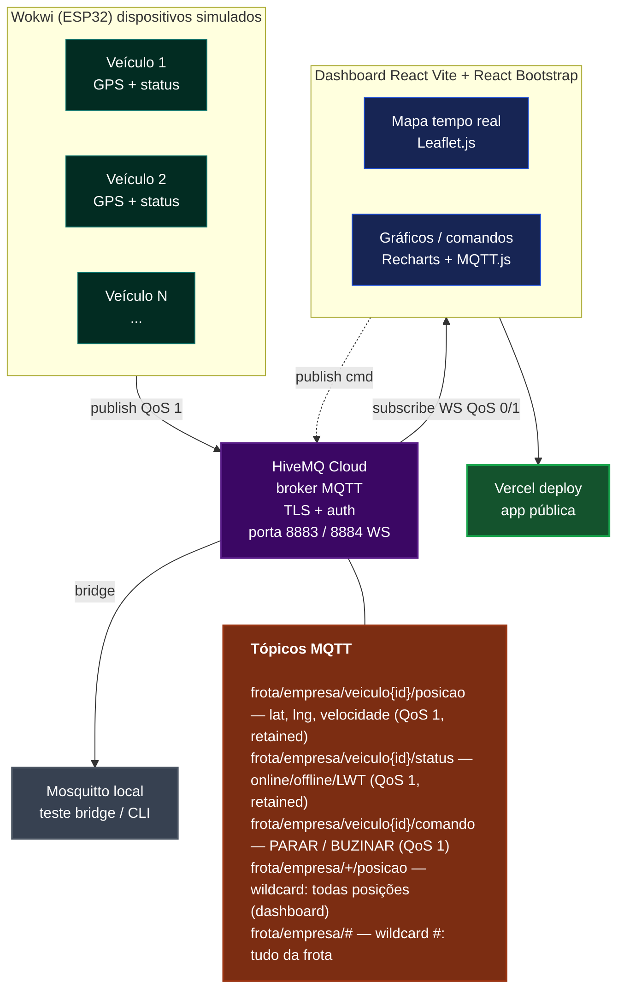

# 🚛 Fleet Monitor — Sistema de Monitoramento de Frota em Tempo Real

> Aplicação distribuída de rastreamento de veículos via MQTT, com dispositivos ESP32 simulados no Wokwi e dashboard web com mapa interativo em tempo real.

---

## 👥 Integrantes da equipe

| Nome completo | 
|---|
| Diego Dantas Domingues |
| Heitor Marques Magalhães |
| João Pedro Ribeiro Lourenço |
| José Marcio Silva Pinho |
| Marcos Vinicius Cardoso de Araújo |

---

## 📌 Tema

**Tema 4 — Sistema de Monitoramento de Frota / Rastreamento**

Veículos simulados (ESP32 no Wokwi) publicam periodicamente posição (lat/lng), velocidade e status via MQTT. Uma central web exibe todos os veículos em um mapa em tempo real e permite enviar comandos remotos (`PARAR`, `RETOMAR`, `BUZINAR`).

---

## 🏗️ Diagrama de Arquitetura


## 📡 Tópicos MQTT

| Tópico | Direção | QoS | Retained | Descrição |
|---|---|---|---|---|
| `frota/empresa/veiculo{id}/posicao` | ESP32 → Broker | 0 | ✅ | Publica lat, lng, velocidade, bateria e status de movimento a cada 3s |
| `frota/empresa/veiculo{id}/status` | ESP32 → Broker | 1 | ✅ | Publica estado do veículo: `online`, `em_rota`, `parado`, `offline` |
| `frota/empresa/veiculo{id}/comando` | Dashboard → ESP32 | 1 | ❌ | Recebe comandos remotos: `PARAR`, `RETOMAR`, `BUZINAR` |
| `frota/empresa/+/posicao` | Broker → Dashboard | — | — | Wildcard `+`: dashboard assina posições de **todos** os veículos |
| `frota/empresa/#` | Broker → Debug | — | — | Wildcard `#`: usado nos testes CLI para capturar **todos** os tópicos da frota |

### Justificativa dos níveis de QoS

- **QoS 0 — posição**: leituras publicadas a cada 3 segundos; a perda eventual de um pacote é aceitável pois o próximo chega logo em seguida.
- **QoS 1 — status e comandos**: importante que o dashboard saiba se o veículo está online ou offline, `PARAR` e `BUZINAR` são comandos críticos que não podem ser duplicados nem perdidos.; pelo menos uma entrega é garantida. 

### Recursos avançados utilizados

- **Retained messages**: tópicos de posição e status são publicados com `retain=true`. Ao conectar, o dashboard recebe imediatamente o último estado conhecido de cada veículo, sem precisar esperar a próxima publicação.
- **Last Will and Testament (LWT)**: ao conectar, cada ESP32 registra um LWT no tópico `frota/empresa/veiculo{id}/status` com payload `{"status":"offline","motivo":"LWT"}`. Se o dispositivo perder a conexão inesperadamente, o broker publica esse payload automaticamente, marcando o veículo como offline no dashboard.

---

## 🛠️ Tecnologias e Bibliotecas

### Dispositivo embarcado
| Tecnologia | Uso |
|---|---|
| ESP32 (Wokwi) | Microcontrolador simulado |
| Arduino (C++) | Linguagem do firmware |
| PubSubClient 2.8 | Cliente MQTT para Arduino |
| ArduinoJson 6.21 | Serialização do payload JSON |
| WiFiClientSecure | Conexão TLS com o broker |

### Broker
| Tecnologia | Uso |
|---|---|
| HiveMQ Cloud (Free Tier) | Broker MQTT na nuvem |
| Mosquitto (local) | Testes via CLI (`mosquitto_sub` / `mosquitto_pub`) |
| MQTT Explorer | Teste visual da hierarquia de tópicos |
| HiveMQ WebSocket Client | Teste via navegador |

### Frontend
| Tecnologia | Uso |
|---|---|
| Vite + React | Framework e bundler |
| React Bootstrap | Componentes de UI |
| MQTT.js | Cliente MQTT via WebSocket no navegador |
| Leaflet.js + React-Leaflet | Mapa interativo com marcadores dos veículos |
| Recharts | Gráficos de velocidade em tempo real |

### Infraestrutura
| Tecnologia | Uso |
|---|---|
| Vercel | Deploy do frontend (PaaS gratuito) |
| GitHub | Versionamento e repositório público |

---

## 🔧 Como executar localmente

### Pré-requisitos
- Node.js 18+
- Conta no [HiveMQ Cloud](https://www.hivemq.com/mqtt-cloud-broker/) com um cluster gratuito criado

### 1. Clone o repositório
```bash
git clone https://github.com/SEU_USUARIO/fleet-monitor.git
cd fleet-monitor
```

### 2. Configure as variáveis de ambiente
```bash
cp .env.example .env
```

Edite o `.env` com suas credenciais do HiveMQ:
```env
VITE_MQTT_HOST=SEU_HOST.hivemq.cloud
VITE_MQTT_PORT=8884
VITE_MQTT_USER=SEU_USUARIO
VITE_MQTT_PASSWORD=SUA_SENHA
```

### 3. Instale as dependências e rode
```bash
npm install
npm run dev
```

### 4. Rode os dispositivos simulados
Acesse os projetos no Wokwi e clique em **▶ Start** em cada um:
- [Veículo 01 — Wokwi](#) [https://wokwi.com/projects/466914333736190977]
- [Veículo 02 — Wokwi](#) [https://wokwi.com/projects/466914215569002497]
- [Veículo 03 — Wokwi](#) [https://wokwi.com/projects/466914471717281793]

---

## 🌐 Aplicação hospedada

🔗 **[fleet-monitor.vercel.app](#)** <!-- substitua pelo link real -->

---

## 🧪 Testes documentados do broker

### Teste 1 — HiveMQ WebSocket Client (navegador)

Conexão via navegador em [hivemq.com/demos/websocket-client](https://www.hivemq.com/demos/websocket-client/) assinando `frota/empresa/#`. As mensagens abaixo foram recebidas com os três veículos simulados rodando simultaneamente:


### Teste 2 — Linha de comando (mosquitto_sub / mosquitto_pub)

Subscribe com wildcard `#` capturando todos os tópicos da frota:

```bash
mosquitto_sub -h SEU_HOST.hivemq.cloud -p 8883 \
  -u SEU_USUARIO -P SUA_SENHA \
  --tls-use-os-certs \
  -t "frota/empresa/#" -v
```

Publish manual simulando o dashboard enviando um comando:

```bash
mosquitto_pub -h SEU_HOST.hivemq.cloud -p 8883 \
  -u SEU_USUARIO -P SUA_SENHA \
  --tls-use-os-certs \
  -t "frota/empresa/veiculo01/comando" \
  -m "PARAR" -q 2
```

<!-- Adicione o print do terminal abaixo -->
<!--  -->

### Teste 3 — MQTT Explorer

Conexão visual mostrando a hierarquia de tópicos em tempo real com os payloads JSON de cada veículo.

<!-- Adicione o print do MQTT Explorer abaixo -->
<!--  -->

---

## 📁 Estrutura do repositório

```
fleet-monitor/
├── wokwi/
│   ├── sketch.ino          # Firmware ESP32 (mesmo código, VEHICLE_ID diferente por projeto)
│   ├── diagram.json        # Circuito do ESP32 no Wokwi
│   └── libraries.txt       # Bibliotecas usadas no Wokwi
├── src/
│   ├── components/
│   │   ├── MapView.jsx     # Mapa Leaflet com marcadores dos veículos
│   │   ├── VehicleList.jsx # Lista de veículos com status e bateria
│   │   ├── CommandPanel.jsx# Painel para enviar PARAR / RETOMAR / BUZINAR
│   │   └── SpeedChart.jsx  # Gráfico de velocidade em tempo real (Recharts)
│   ├── hooks/
│   │   └── useMqtt.js      # Hook centraliza conexão MQTT.js via WebSocket
│   ├── App.jsx
│   └── main.jsx
├── .env.example
├── vite.config.js
└── README.md
```

---

## 📸 Screenshots

<!-- Adicione screenshots da aplicação rodando -->
<!--  -->
<!--  -->
<!--  -->

---

## ⚖️ Decisões de projeto

**Por que HiveMQ Cloud?** Plano gratuito generoso (100 conexões, sem limite de mensagens), suporte nativo a TLS na porta 8883 e WebSocket na 8884 sem configuração adicional, e painel web integrado para monitoramento.

**Por que MQTT.js direto no navegador (sem backend HTTP)?** Simplifica a arquitetura — o dashboard conecta via WebSocket diretamente ao broker, eliminando a necessidade de um servidor intermediário. Reduz latência e complexidade de deploy.

**Por que Vite + React?** Ecossistema maduro, HMR rápido para desenvolvimento, e deploy trivial no Vercel com zero configuração.

**Por que Wokwi e não hardware físico?** Permite simular múltiplos veículos simultaneamente em abas do navegador, com rotas programáveis e sem dependência de hardware. A comunicação MQTT é real (broker na nuvem), apenas o hardware é simulado.

---

## 📜 Créditos

- [PubSubClient](https://github.com/knolleary/pubsubclient) — Nick O'Leary
- [ArduinoJson](https://arduinojson.org/) — Benoit Blanchon
- [MQTT.js](https://github.com/mqttjs/MQTT.js)
- [React Leaflet](https://react-leaflet.js.org/)
- [Recharts](https://recharts.org/)
